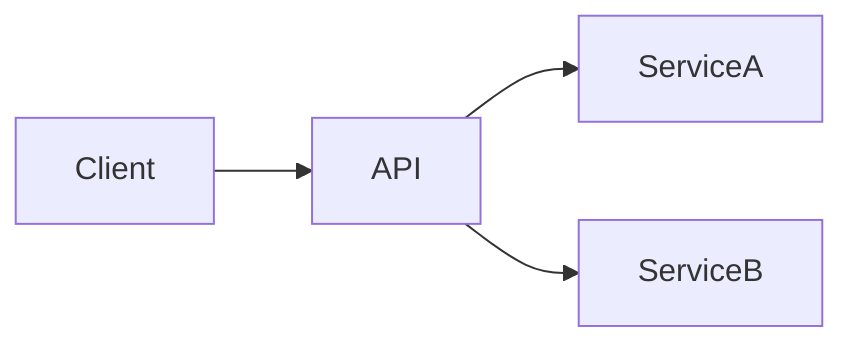

# History of APIs 📜

Application Programming Interfaces (APIs) are a foundational concept in modern software development. While they are often associated with web services and cloud platforms today, APIs have a much longer history that parallels the evolution of computing itself.

::: callout info "What is an API?"
An API defines how different software components communicate with each other using well-defined rules and interfaces.
:::

---

## Early Foundations (1960s–1970s)

In the earliest days of computing, programs were tightly coupled to hardware. As operating systems matured, **system calls** emerged as a structured way for applications to request services such as memory allocation, file access, and process control.

These system calls are considered the earliest form of APIs. They introduced the idea of abstraction—allowing developers to use system functionality without knowing internal implementation details.

::: card "Key Concept"
**Abstraction** allows software to evolve independently from the hardware it runs on.
:::

---

## Library and OS APIs (1980s)

With the rise of personal computers, operating systems began exposing richer APIs to developers. Platforms such as UNIX and Microsoft Windows provided standardized interfaces that allowed third-party applications to interact consistently with the system.

At the same time, programming languages shipped with **standard libraries**, offering reusable functions that further reinforced API-driven development.

```c
// Example: C standard library usage
printf("Hello, world!");
````

---

## Object-Oriented and Enterprise APIs (1990s)

The adoption of object-oriented programming expanded APIs beyond simple functions to include classes, methods, and interfaces. Languages such as Java popularized large, well-documented API ecosystems.

Enterprise technologies like COM, CORBA, and later Java EE enabled large-scale system integration across distributed environments.

::: callout tip "Why this mattered"
Reusable APIs reduced duplication and made large systems easier to maintain.
:::

---

## The Rise of Web APIs (2000s)

The internet transformed APIs into platform-independent communication tools. Web APIs allowed systems written in different languages to communicate over HTTP.

A major milestone occurred in 2000 when **Roy Fielding** introduced REST (Representational State Transfer) in his doctoral dissertation. REST defined principles such as statelessness, resource-based URLs, and standard HTTP methods.

::: tabs
== tab "REST Example"

```http
GET /users/123 HTTP/1.1
Host: api.example.com
```

== tab "Response (JSON)"

```json
{
  "id": 123,
  "name": "Alice"
}
```

:::

---

## Modern APIs and Cloud Computing (2010s–Present)

Today, APIs power cloud platforms, mobile applications, and microservices architectures. Companies expose public APIs to enable integrations, while internal APIs support scalable distributed systems.

Modern API styles include:

* REST APIs
* GraphQL APIs
* Event-driven and streaming APIs



---

## Why APIs Matter Today

::: callout success "Strategic Importance"
APIs are no longer just technical tools—they are products, platforms, and business enablers.
:::

APIs enable faster development, cross-platform compatibility, and innovation by allowing teams to build on existing services instead of reinventing them.

---

## Conclusion

From early system calls to modern cloud-based services, APIs have evolved to meet the growing complexity of software systems. Their history reflects a continuous effort to improve abstraction, interoperability, and scalability in computing.

---

## Sources 📚

1. Fielding, R. T. (2000). *Architectural Styles and the Design of Network-based Software Architectures*. University of California, Irvine.
2. Bloch, J. (2006). *How to Design a Good API and Why It Matters*. ACM.
3. Tanenbaum, A. S., & Bos, H. (2015). *Modern Operating Systems* (4th ed.). Pearson.
4. IBM Documentation – *API Concepts and History*.
5. Red Hat – *What is an API?*