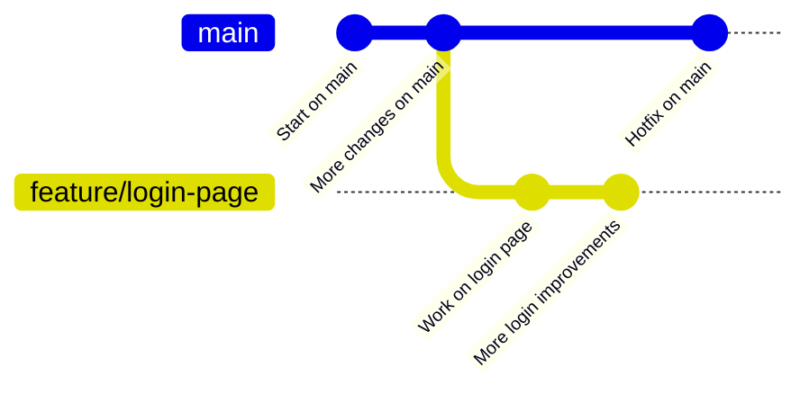
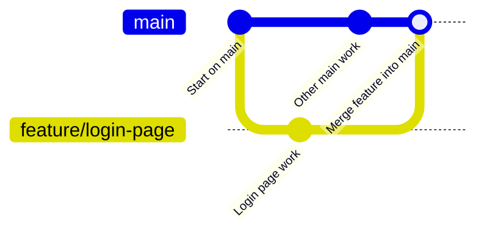

# Branches and Merging (Working Safely with Changes)

Branches and merging are two of the most powerful ideas in Git, but they can be explained in simple terms.

- A **branch** is like a **separate copy of your project’s timeline**.
- **Merging** is how you **bring changes from one branch into another**.

---

## Simple Analogy: Writing a Book with Drafts

Imagine you and your team are writing a book:

- The **main branch** (`main`) is the official book everyone trusts.
- You want to try a **new chapter**, but you are not sure if it will be good.

Instead of editing the official book directly, you:

1. Make a **copy** of the book for experimentation — this is your **feature branch**.
2. Edit the copy safely.
3. If everyone likes your changes, you **merge** them back into the official book.

This is exactly what branches and merging do for code.

---

## What Is a Branch?

A branch in Git:

- Has its own **history of commits**
- Starts from another branch (usually `main`)
- Lets you work on changes **without affecting** the original branch

By default, your project has a main branch called `main` (or sometimes `master`).

Here is a picture of a simple branching timeline:



---

## Checking Your Current Branch

To see which branch you are on:

```bash
git status
```

You will see something like:

```text
On branch main
```

Here, `main` is the current branch.

---

## Creating a New Branch

To create a new branch, for example for a login feature, run:

```bash
git checkout -b feature/login-page
```

This does two things:

1. **Creates** a new branch called `feature/login-page`
2. **Switches** you to that branch

Now any changes and commits you make are part of this new branch, not `main`.

---

## Switching Between Branches

To switch back to the `main` branch:

```bash
git checkout main
```

To switch again to your feature branch:

```bash
git checkout feature/login-page
```

**Important:**  
You should commit or stash your changes before switching branches, otherwise Git may stop you to avoid losing work.

---

## Typical Workflow with a Feature Branch

Here’s a common flow:

```bash
# 1. Make sure main is up to date
git checkout main
git pull

# 2. Create and switch to a new branch
git checkout -b feature/login-page

# 3. Make changes to files (in your editor)

# 4. Stage and commit your changes
git add .
git commit -m "Add basic login page layout"

# 5. Push your branch to the remote
git push -u origin feature/login-page
```

Now your teammates can see your branch and review it (often via a pull request or merge request).

---

## What Is Merging?

**Merging** means **combining the history of one branch into another**.

Example:

- You worked on `feature/login-page`
- You want to bring those changes into `main`

You will:

1. Go to the branch that should receive the changes (for example, `main`)
2. Run `git merge` with the name of the other branch

Visually, a merge brings two lines of work back together:



---

## Merging a Branch Locally

Example of merging `feature/login-page` into `main`:

```bash
# 1. Switch to main
git checkout main

# 2. Make sure main is up to date
git pull

# 3. Merge the feature branch into main
git merge feature/login-page
```

If Git can combine everything automatically, you will see a success message.  
Then you can push the updated `main` to the remote:

```bash
git push
```

---

## Fast-Forward vs Merge Commit (Simple View)

You might see terms like:

- **Fast-forward**
- **Merge commit**

You do not need to know all the internals, but here is a simple explanation:

- **Fast-forward**:  
  `main` had no new commits, so Git just **moves the pointer forward** to include your feature branch. This is the simplest case.

- **Merge commit**:  
  Both `main` and your feature branch had new commits. Git creates a **new commit** that joins both histories.

In both cases, the end result is:  
`main` now includes the changes from `feature/login-page`.

---

## When Merging Causes Conflicts

Conflicts happen when:

- Two branches changed the **same lines in the same file**

Example:

- On `main`, someone changes the title in `home-page.md`.
- On your `feature` branch, you change that same title in a different way.

When you try to merge, Git cannot choose which version is correct.

You will see conflict markers like:

```text
<<<<<<< HEAD
Title from the branch you are merging into (for example, main)
=======
Title from the branch you are merging (for example, feature/login-page)
>>>>>>> feature/login-page
```

To resolve:

1. Open the file in your editor
2. Decide which text to keep (or combine both)
3. Remove the `<<<<<<<`, `=======`, and `>>>>>>>` lines
4. Save the file
5. Stage and commit the resolution:

```bash
git add home-page.md
git commit -m "Resolve merge conflict in home-page title"
```

After this, the merge is complete.

---

## Everyday Example: Branch and Merge

Scenario:

- The team uses the `main` branch for production
- You need to add FAQ content on the website

Steps:

```bash
# Start from the latest main
git checkout main
git pull

# Create a new branch for the FAQ work
git checkout -b feature/add-faq-section

# Edit files (for example, faq.md) in your editor

# Save and commit your changes
git add faq.md
git commit -m "Add FAQ section for common customer questions"

# Push the branch
git push -u origin feature/add-faq-section

# (Optionally) Open a Pull Request / Merge Request in your Git platform

# After review and approval, merge into main (could be done via the platform or locally)
git checkout main
git pull
git merge feature/add-faq-section
git push
```

This way:

- `main` stays stable
- New work happens safely in branches
- Changes are combined in a controlled way

