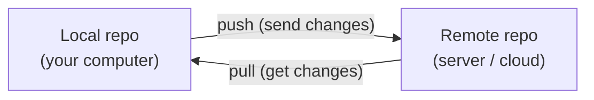

# Git Terms Glossary (Plain Language)

This page explains common Git words in **simple, non-technical language**.  
Use it as a quick reference when you see unfamiliar terms in tools like GitHub, GitLab, or your terminal.

---

## Repository (Repo)

**What it means:**  
A **repository** (or **repo**) is the **project folder that Git is watching**.

It contains:

- Your files and folders
- The history of changes (commits)
- Branches and other Git data

**Analogy:**  
Think of a repo as a **project binder** that holds all versions of your document, not just the latest one.

---

## Local vs Remote

**Local repository:**  
The copy of the Git project on **your own computer**.

**Remote repository:**  
The copy of the Git project on a **server** (for example on GitHub, GitLab, or Bitbucket).

**Analogy:**  
Local = files on your laptop.  
Remote = files stored in your team’s shared cloud drive.

You can think of the relationship like this:



---

## Clone

**What it means:**  
To **download a full copy of a remote repository to your local computer**.

Command example:

```bash
git clone https://github.com/company/project.git
```

**Analogy:**  
Like saving a shared online folder to your own computer for the first time.

---

## Commit

**What it means:**  
A **commit** is a **saved snapshot** of your project at a point in time, with a message describing what changed.

Command example:

```bash
git commit -m "Fix typo on home page"
```

**Analogy:**  
Like clicking “Save a version” in a document editor and writing a short note about what you changed.

---

## Commit Message

**What it means:**  
The short description you write when making a commit.

Good commit messages are:

- Clear
- Short
- Specific

Examples:

- `"Update footer copyright year"`
- `"Add checkout button to cart page"`

---

## Branch

**What it means:**  
A **branch** is a **separate line of work** in the same repository.

Each branch can have:

- Its own commits
- Its own changes

Common branch names:

- `main` (or `master`) – the main, stable branch
- `feature/login-page` – a branch to build a new login page

**Analogy:**  
Like making a copy of a document so you can try changes without touching the original.

---

## Main (or Master) Branch

**What it means:**  
The **primary branch** of a project where the **most stable** version of the code lives.

Teams often:

- Deploy from `main` to production
- Protect `main` with reviews and approvals

---

## Checkout

**What it means:**  
To **switch to a different branch** or **move to a specific commit**.

Examples:

```bash
git checkout main
git checkout feature/login-page
```

**Analogy:**  
Like choosing which version of a document you want to open and edit.

---

## Remote (Origin)

**What it means:**  
A **remote** is a **named connection** to a repository on a server.

`origin` is the default name Git uses for the main remote repository.

Example:

```bash
git push origin main
```

This means: push the `main` branch to the `origin` remote.

---

## Push

**What it means:**  
To **send your local commits to the remote repository**.

Command:

```bash
git push
```

**Analogy:**  
Like clicking “Upload” to send your updated document to a shared drive.

See the **Pushing Code** page for step-by-step details.

---

## Pull

**What it means:**  
To **download and merge** new commits from the remote repository to your local repository.

Command:

```bash
git pull
```

**Analogy:**  
Like clicking “Download latest version” of a shared document.

See the **Pulling Code** page for more.

---

## Merge

**What it means:**  
To **combine the changes from one branch into another**.

Example:

```bash
git merge feature/login-page
```

This means: merge the `feature/login-page` branch into your current branch.

**Analogy:**  
Like taking edits from a draft copy and carefully adding them into the official document.

---

## Merge Conflict

**What it means:**  
A situation where **two branches changed the same part of the same file**, and Git cannot decide which version to keep.

Git marks the conflict and asks you to:

- Open the file
- Choose which changes to keep (or combine them)
- Save and commit the result

**Analogy:**  
Two people edit the same sentence in different ways.  
Someone has to manually choose the final wording.

---

## Pull Request / Merge Request (PR / MR)

**What it means:**  
A **pull request** (GitHub) or **merge request** (GitLab, Bitbucket) is a **formal request to merge one branch into another**, usually with:

- A description of the change
- A place for comments
- Code review from teammates

**Analogy:**  
Like asking a colleague: “Please review my edits and, if you agree, add them to the official document.”

---

## Stash

**What it means:**  
To **temporarily set aside your unfinished changes** without committing them, so you can switch branches or pull updates.

Example:

```bash
git stash
```

Later you can bring those changes back with:

```bash
git stash pop
```

**Analogy:**  
Putting your notes into a drawer for a moment so you can work on something else, then taking them back out later.

---

## Status

**What it means:**  
The current state of your working directory and staging area:

- Which files changed
- Which files are staged
- Which branch you are on

Command:

```bash
git status
```

This is one of the safest and most helpful commands to run often.

---

## Log

**What it means:**  
The **history of commits** in your repository.

Command:

```bash
git log
```

This shows:

- Who made each commit
- When it was made
- The commit message

**Analogy:**  
Like a timeline or journal of all important changes to your project.

---

## Summary

You do not need to memorize all Git terms at once.  
Keep this glossary open while you work, and refer back to it whenever you see a word you don’t understand.

