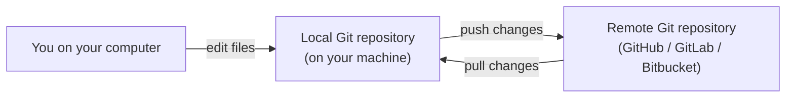

# Git Basics for Everyone

Git is a tool that **keeps track of changes to your files over time**.  
You can think of it like **the history feature in Google Docs, but for code projects**.

With Git you can:

- **Save snapshots** of your work (called *commits*)
- **Go back in time** if something breaks
- **Work together** with other people on the same project without overwriting each other
- **Experiment safely** on separate lines of work (called *branches*)

Here is a simple picture of how Git connects **you**, your **local copy**, and the **shared remote**:



---

## Simple Story: Why Git Is Helpful

Imagine your team is writing a big document:

- On Monday, you save a version called `v1`.
- On Tuesday, you make changes and save `v2`.
- On Wednesday, a mistake is found, and you wish you could go back to `v1`.

Without a system, you might have many messy files:  
`project-final.doc`, `project-final-FINAL.doc`, `project-please-use-this-one.doc`.

Git solves this by:

- Keeping **one folder** for your project
- Remembering every change inside a **timeline**
- Letting you **move back and forward** in that timeline

---

## Common Things You Will Do with Git

In this Git section, we will walk you through:

- **Pushing code**: sending your changes from your computer to a shared online place (like GitHub)
- **Pulling code**: bringing the latest changes from the shared place down to your computer
- **Branches**: creating separate lines of work so you can experiment without breaking the main project
- **Merging**: bringing changes from one branch into another (for example, from a feature branch into `main`)
- **Git terms**: understanding simple meanings of words like *commit*, *repository*, *remote*, and more

You do **not** need to be “technical” to follow along.  
We will use **plain language** and **step‑by‑step instructions** with examples.

---

## What You Need Before You Start

To follow the examples:

- **Git installed** on your computer (usually installed by IT or via a Git installer)
- An account on a Git hosting service, such as:
  - GitHub
  - GitLab
  - Bitbucket
- A project that already uses Git (your team or company will usually provide this)

If you are not sure whether Git is installed, open your terminal or command prompt and type:

```bash
git --version
```

If you see a version number, Git is installed.  
If you see an error, ask your IT team to help you install Git.

---

## How This Guide Is Organized

Use the navigation on the left to read topics in this order:

1. **Pushing Code** – how to send your work to the shared repository
2. **Pulling Code** – how to get your teammates’ latest changes
3. **Branches & Merging** – how to work on features safely and combine changes
4. **Git Terms Glossary** – quick reference for the words you will see in Git tools

You can come back to this page any time you want a high‑level reminder of what Git is and why it is useful.

