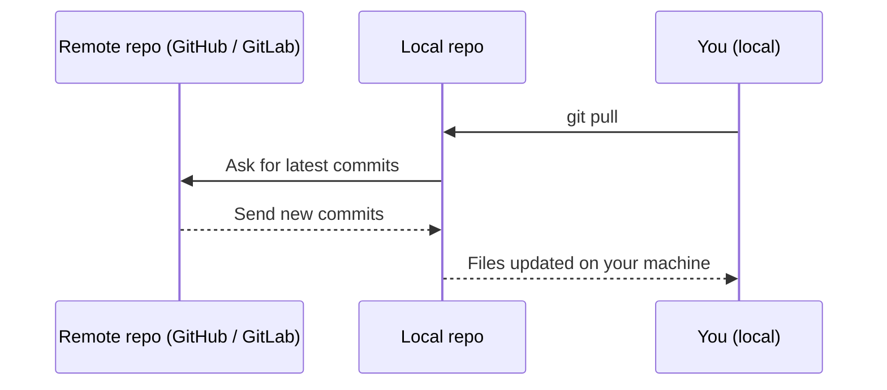

# Pulling Code (Getting the Latest Changes)

**Pulling code** means **getting the newest changes from the shared online repository onto your computer**.

Think of it like:

- Your teammates have updated the document online.
- You click “refresh” to download their latest version to your computer.

In Git terms:

- The shared place (e.g. GitHub) is the **remote repository**.
- Your computer has the **local repository**.
- `git pull` brings changes from **remote → local**.

Here is a simple diagram of a pull:



---

## When Should You Pull?

You should run `git pull`:

- **Before you start work each day** – to make sure you start from the latest version
- **Before you create a new branch** – so your branch is based on recent work
- **Before you push your own changes** – to avoid conflicts when others have pushed earlier

Pulling regularly helps keep everyone’s work in sync.

---

## Basic Command: `git pull`

In your project folder, open a terminal or command prompt and run:

```bash
git pull
```

Git will:

1. Connect to the remote repository
2. Download any new commits
3. Try to automatically combine them with your local branch

If your branch is called `main` and the remote is `origin`, this is usually the same as:

```bash
git pull origin main
```

---

## Example: Starting Your Day

Here’s a simple daily routine:

```bash
cd your-project-folder

# See your current branch and status
git status

# Get the latest changes from the remote
git pull
```

After `git pull` finishes:

- Your local files are updated
- You see any new code or text your teammates have added

---

## What Happens If There Are No New Changes?

If your local branch is already up to date, Git will show a message like:

```text
Already up to date.
```

This simply means:

- There is **nothing new** to download
- You are already on the latest version of that branch

---

## What If There Are New Changes?

If there are new commits on the remote branch, Git will:

- Download them
- Try to **merge** them with your local branch automatically

You might see messages showing:

- Which files changed
- How many lines were added or removed

Example (simplified):

```text
Updating 1234567..89abcde
Fast-forward
 README.md | 5 +++--
 1 file changed, 3 insertions(+), 2 deletions(-)
```

You can now open your files and see the latest content.

---

## When Pull Causes a Conflict

Sometimes, both you and a teammate edit **the same part of the same file**.  
When you run `git pull`, Git may not know which version to keep.

This is called a **merge conflict**.

In that case, Git will:

- Stop and mark the conflict in the file
- Ask you to **manually decide** which change to keep (yours, theirs, or both)

Example conflict markers in a file:

```text
<<<<<<< HEAD
Your version of the text here.
=======
Teammate's version of the text here.
>>>>>>> origin/main
```

To fix this:

1. Open the file in your editor
2. Choose the correct text (or combine both)
3. Remove the `<<<<<<<`, `=======`, and `>>>>>>>` lines
4. Save the file
5. Run:

```bash
git add path/to/conflicted-file
git commit -m "Resolve merge conflict in file"
```

You will learn more about this in **Branches & Merging**.

---

## Simple Workflow: Pull Before Push

A safe habit is:

1. **Pull first** to get the latest changes
2. Then **push** your own changes

Example:

```bash
# Get latest changes from remote
git pull

# (If there are conflicts, resolve them and commit)

# Send your new commits to remote
git push
```

This reduces the chance that your push will be rejected due to other people’s new commits.

