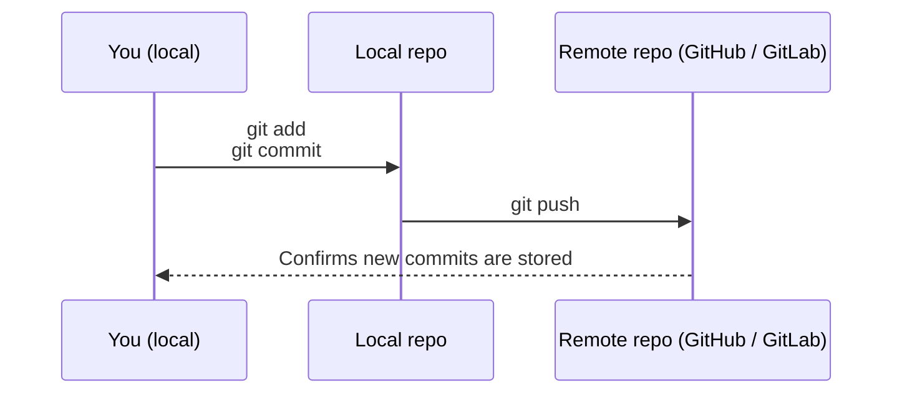

# Pushing Code (Sending Your Work Online)

**Pushing code** means **sending your latest changes from your computer to the shared online repository**  
(for example, on GitHub, GitLab, or Bitbucket).

Think of it like:

- You write some changes on your **local copy** of a document.
- When you are happy, you **upload** those changes so your team can see them.

In Git terms:

- Your computer has a **local repository**.
- The shared place (e.g. GitHub) is the **remote repository**.
- `git push` sends your changes from **local → remote**.

Visually, pushing looks like this:



---

## Before You Push: The Basic Flow

Usually, you follow these three steps:

1. **Check what changed**
2. **Stage the changes** (choose what to include)
3. **Commit** the changes (save a snapshot)
4. **Push** the commit(s) to the remote repository

We will walk through each step with simple examples.

---

## 1. Check What Changed

In your project folder, open a terminal or command prompt and run:

```bash
git status
```

This shows:

- Which files are **new**
- Which files have been **modified**
- Which files are **ready to be committed**

Example output (simplified):

```text
On branch main
Changes not staged for commit:
  modified:   README.md
Untracked files:
  new-feature.txt
```

This tells you Git sees changes but you have not prepared them yet.

---

## 2. Stage the Changes

Staging means **selecting which files you want to include** in your next snapshot (commit).

- To stage **one file**:

```bash
git add README.md
```

- To stage **all changed files** in the project:

```bash
git add .
```

After staging, run `git status` again:

```bash
git status
```

You should now see something like:

```text
Changes to be committed:
  modified:   README.md
  new file:   new-feature.txt
```

This means Git is ready to save these files in the next commit.

---

## 3. Commit Your Changes

A **commit** is like a **named snapshot** of your project at a point in time.

To create a commit, run:

```bash
git commit -m "Add new feature description"
```

- The text inside quotes is your **commit message**.
- Use simple, clear language like:
  - `"Fix typo in introduction"`
  - `"Update home page content"`
  - `"Add login button styling"`

After you commit, your changes are now:

- Saved **locally** in your Git history
- **Not yet** uploaded to the shared remote repository

---

## 4. Push Your Commit to the Remote

To send your commit(s) to the remote repository, run:

```bash
git push
```

In many teams, the main branch is called `main` or `master`.  
If you’re on a different branch (for example, `feature/login-page`), Git will push that branch to the remote.

Example:

```bash
git push origin main
```

Here:

- `origin` is the **name of the remote** (usually the default)
- `main` is the **name of the branch** you are pushing

After this command succeeds, your teammates can see your changes online.

---

## Complete Example: From Change to Push

Imagine you updated a file called `home-page.md`.

Step-by-step:

```bash
# 1. See what changed
git status

# 2. Stage the file
git add home-page.md

# 3. Commit with a clear message
git commit -m "Update home page introduction text"

# 4. Push to the remote repository
git push
```

If everything is set up correctly, you will see messages that your branch was pushed successfully.

---

## Common Questions

**Q: What if `git push` asks for a username or password?**  
A: This means Git needs to authenticate you with the remote service (like GitHub).  
Follow your company’s instructions (they may use a token, SSH key, or single sign-on).

**Q: What if `git push` is rejected?**  
A: Often this means someone else has pushed changes before you.  
You usually need to:

```bash
git pull
```

to bring their changes down first, resolve any conflicts, then push again.  
You can learn more about this in the **Pulling Code** and **Branches & Merging** pages.

