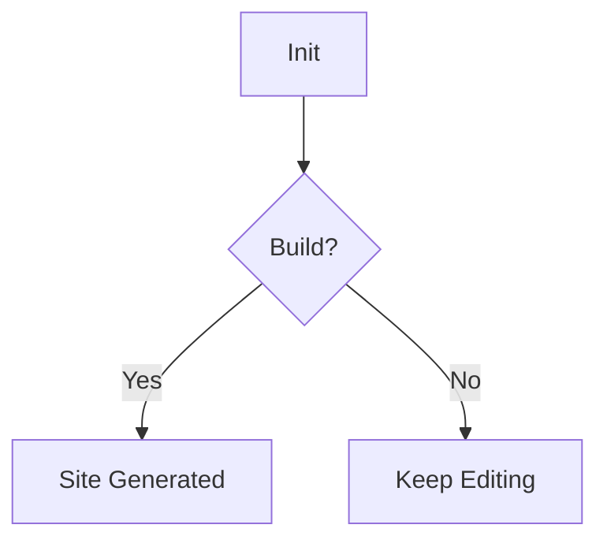

# Welcome to Your Docs 🚀

Congratulations! You have successfully initialized a new **docmd** project.

## Quick Start

You are currently viewing `docs/index.md`.

```bash
npm start   # Start the dev server
docmd build # Build for production
```

## Features Demo

### 1. Smart Containers
::: callout tip "Did you know?"
You can nest containers, add custom titles, and use emojis! :tada:
:::

::: card "Flexible Structure"
Organize your content with cards.
::: button "View Documentation" https://docs.docmd.io
:::

### 2. Tabs & Code
::: tabs
== tab "JavaScript"
```javascript
console.log('Hello World');
```

== tab "Python"
```python
print('Hello World')
```
:::

### 3. Diagrams (Mermaid)


## Next Steps

*   [Check the Official Documentation](https://docs.docmd.io)
*   [Customize your Theme](https://docs.docmd.io/theming)
*   [Deploy to GitHub Pages](https://docs.docmd.io/deployment)

Happy documenting! 🎉